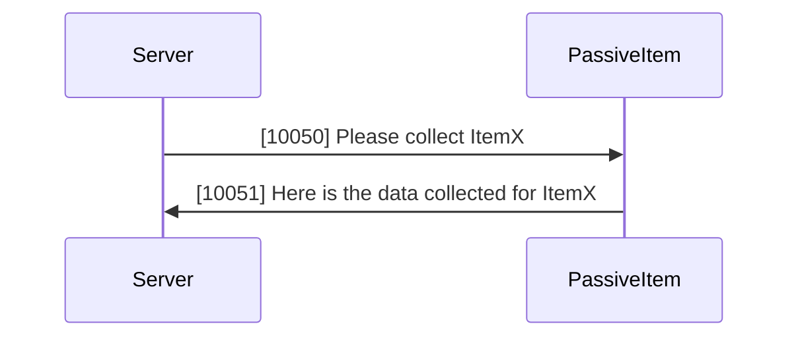
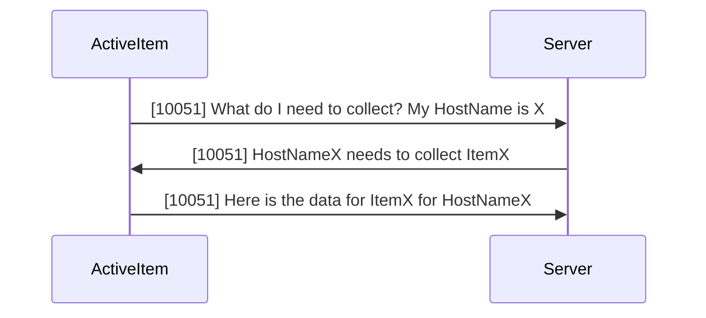

# Zabbix Notes

## Host Availability

- If item collection fail then recheck every UnreachableDelay (15s) until UnreachablePeriod is reached (60s), if FAIL mark host as unreachable

- If host is unreachable then recheck every UnavailableDelay (60s)

## Passive vs Active Items

### Passive Item Collection

Zabbix Server communicates to the Host via the IP/DNS configured in the Interface.

### Active Item Collection

Zabbix Server communicates to the Host via the IP/DNS configured in the Interface. The correct HostName MUST be configured in the Zabbix Agent configuration for this conversation to occur.

